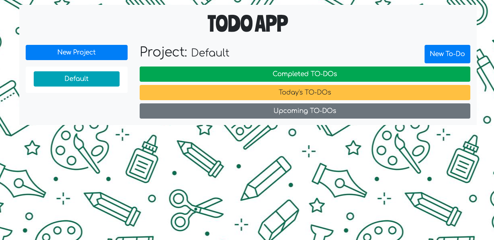

# Todo List Application

> This project consists of building a todo list application with Javascript and firebase hosting.



## Built With

- Javascript
- Firebase
- Webpack
- HTML5
- CSS
- Bootstrap 4.5
- ESLint
- Stylelint

## Usage

- To start the application follow the link given in the live demo.
- A default project is assigned to you via a auto generated username.
- Add new projects.
- Add new todos within those projects you create

## Live Demo

[Live Demo Link](https://todo-list-41950.web.app/)


## Requirements

- Compatible Web browser (Chrome, Mozilla, IE, Safari)

## Installation

### Prerequisite

- Create a firebase [account](https://console.firebase.google.com/)
- Install [firebase CLI](https://firebase.google.com/docs/cli)
- Install [Node](https://nodejs.org/en/)

### Steps

From the command line/terminal clone the repository:

```
$ git clone https://github.com/abdelp/todo-list-js.git
```

Initialize the firebase hosting service

```
$ firebase init
```

Select firestore and hosting features:


Select public/dist as the public directory:


## Deploy

To deploy on your local environment run:

```
$ firebase serve
```

To deploy to your firebase production environment:

```
$ firebase deploy
```

## Authors

👤 **Abdel Pérez**

- Github: [@abdelp](https://github.com/abdelp/)
- Twitter: [@AbdelPerez11](https://twitter.com/abdelperez11)
- Linkedin: [Abdel Pérez](https://www.linkedin.com/in/abdel-perez/)


👤 **Elbie Moonga**
- GitHub: [@Elbie-Em](https://github.com/Elbie-em)
- Twitter: [ElbieEm](https://twitter.com/ElbieEm)
- LinkedIn: [elbie-moonga](https://www.linkedin.com/in/elbiemoonga/)

## 🤝 Contributing

Contributions, issues and feature requests are welcome!

Feel free to check the [issues page](https://github.com/abdelp/todo-list-js/issues).

## Show your support

Give a ⭐️ if you like this project!

## 📝 License

This project is [MIT](lic.url) licensed.